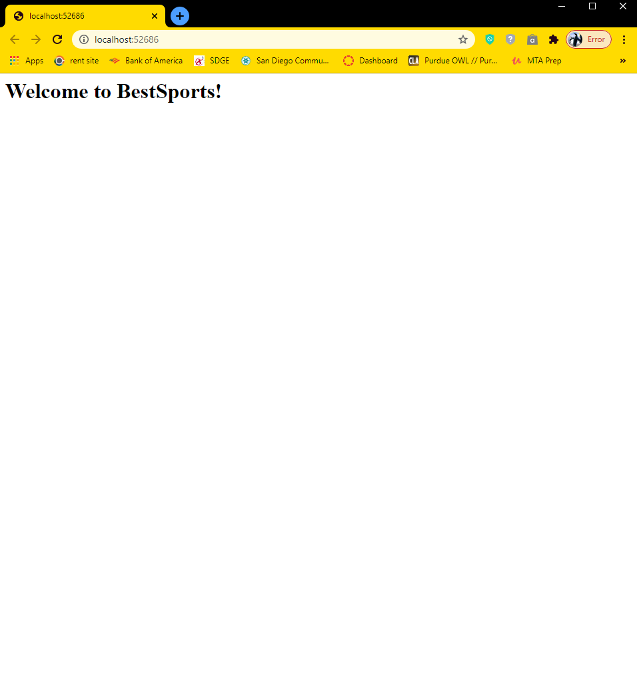
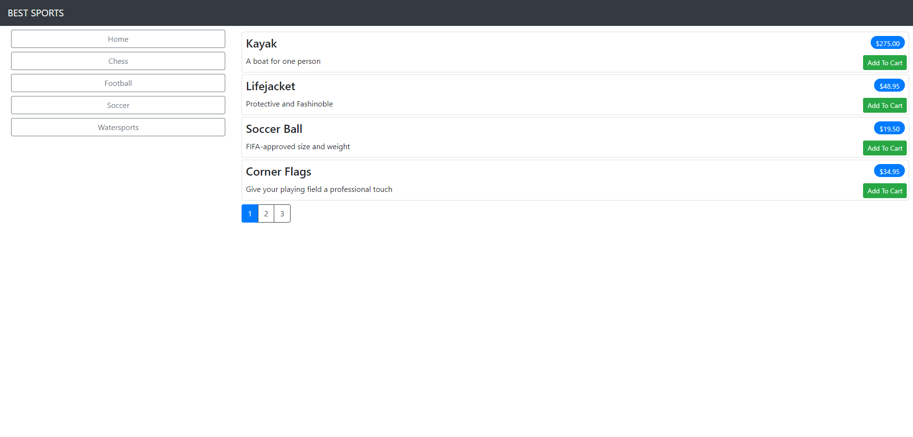
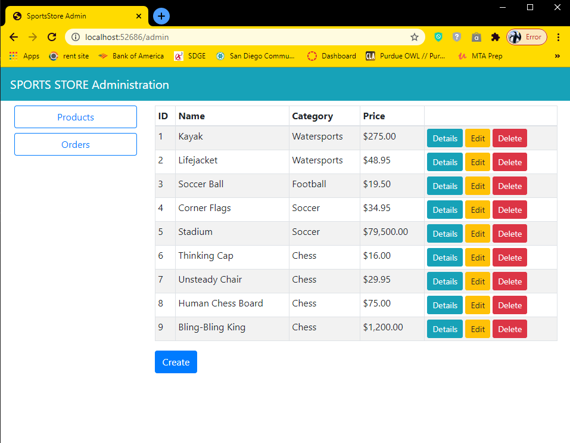
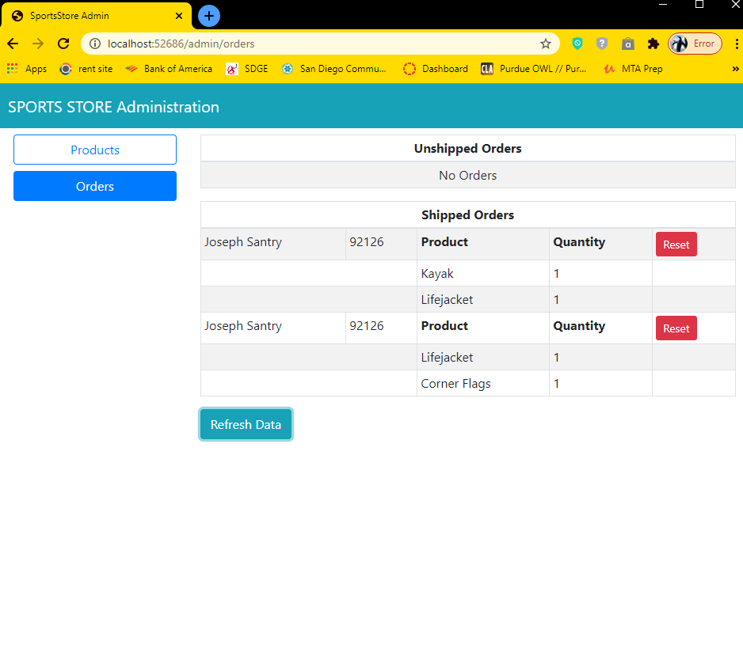
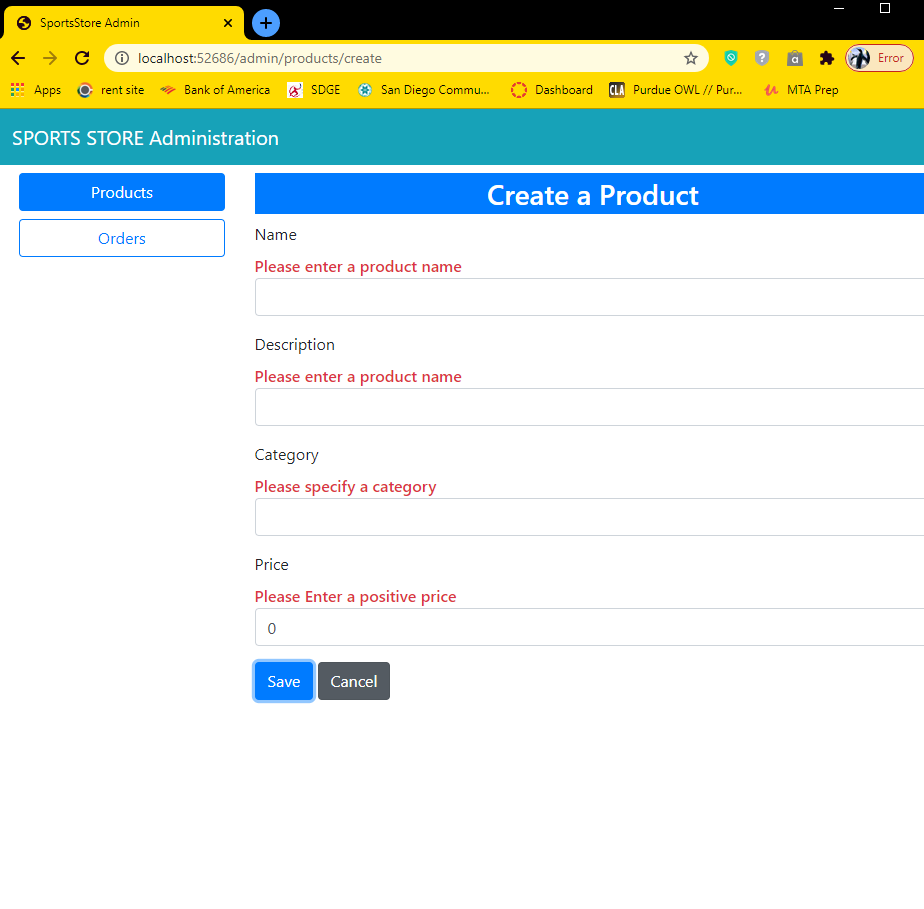

# BestSports
The BestSports web store

## This is a Student Project
 The source of the code is from author, Adam Freeman, You can view his work at https://www.apress.com/gp/book/9781484254394.

## Steps
1. Created base template using PowerShell.
2. followed all the steps in chapter 7 - started the cart and products list.
3. followed all steps of chapter 8 - finished the Checkout and cart.
4. followed all steps of chapter 9 - added Razor Pages.
5. followed all steps of chapter 10 - Added Blazor Pages.
## First running page
This is a picture of the beggining page for the project at its intial startup

---
## This is the final look after the fist chapter was completed

---

## These are the final snapshots for the Chapter 8

---

## These are the final snapshots of Chapter 9

---

## These are Chapter 10 snapshots

