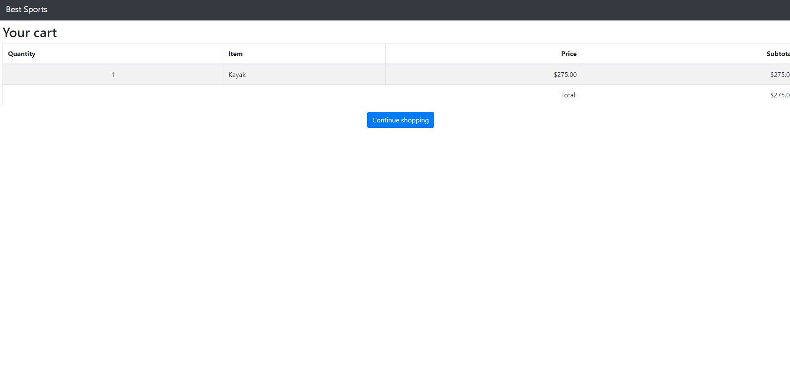

# BestSports
The BestSports web store

## This is a Student Project
 The source of the code is from author, Adam Freeman, You can view his work at https://www.apress.com/gp/book/9781484254394.

## Steps
1. Created base template using PowerShell.
2. followed all the steps in chapter 7.

## First running page
This is a picture of the beggining page for the project at its intial startup

---
## This is the final look after the fist chapter was completed

---

## These are the final snapshots for the Chapter 8

